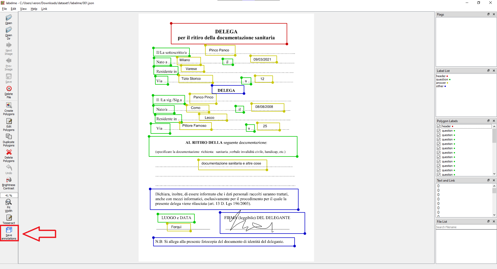

# How to use it 
 1. [Create your sentence label](#create-your-sentence-label)
 2. [Use Tesseract button to detect words](#use-tesseract-button)
 3. [If needed, adjust words' text manually](#manual-adjustment)
 4. [Add linking manually](#manual-linking )
 5. [Save your JSON annotation](#save-annotations)

## Create your sentence label
A sentence label is a rectangle that contains a sentence and has a label (such as question, answer, ... ).  
With these Labelme will be able to group words into sentences.

To create a Rectangle go on top menu then _edit_ then _create rectangle_ or use shortcut Ctrl+R.

While in create mode you can't select polygons.  
To go in selection mode go on top menu  then _edit_ than _edit polygons_ or press Ctrl+J.

>**_Tip:_** make sure to do this passage before you use the tesseract button.  
Rectangles stack on your work area, so it will be difficult to select the ones on the bottom.  
> _wrong:_
>  
> _right:_
>

## Use Tesseract button 
You can find this button on left menu.  

There are two modes for this button:
 * if there aren't selected polygons, Tesseract will run on the whole 
   image and detect every word
 * else it will use Tesseract on a cropped portion of your image corresponding to 
   every selected polygon

It's suggested to use Tesseract on the whole image for the first time.  

Then if some words aren't detected add a rectangle labeled _word_ and click Tesseract on the new rectangle while selected.
If some words are detected but have wrong text try Tesseract only on the selected rectangle.  

If Tesseract detect some text that shouldn't, just delete the polygon.

>**_Tip:_** be sure all rectangle words are contained in your sentence label otherwise they will not be included in the sentence text.  
> _Before adjustment:_
>  
> _After:_
> 

## Manual adjustment
Sometimes Labelme's Tesseract does not detect some words.  
If you get the wrong text even after you use the Tesseract button on a selected polygon, you'll need to adjust it by hand.  
To edit text double click on an item in Text and Link widget or right click then _edit label text_.  

## Manual linking 
With Labelme you can link some polygons.  
For example if you have a question label maybe you want to link it to the corresponding answer.  
To do so select your rectangles then click on top menu _Link_ then _Link_ or use Ctrl+L shortcut. 

Linking always **overwrites**, so be sure to select right polygons.

## Save annotations
After you are done with all your adjustment, you can generate your ground truth.  
Press the button _Save annotations_ and select your directory in the pop-up window.  
